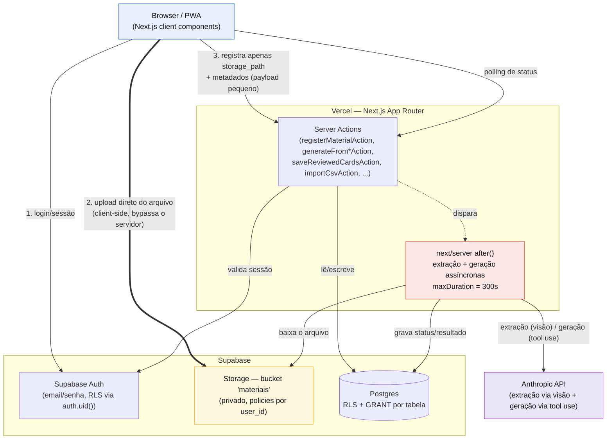
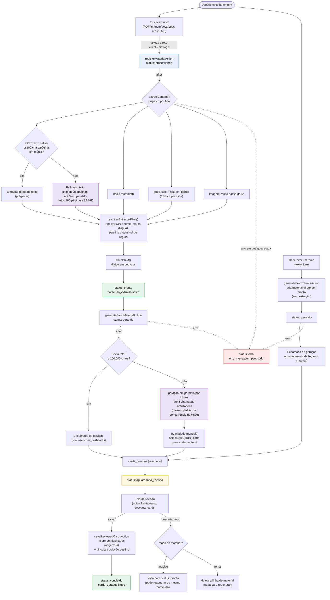

# Arquitetura — Meus Flashcards AI

Documento gerado a partir da leitura real do código (estrutura de pastas, migrations em
`supabase/migrations/`, Server Actions em `app/(app)/upload/actions.ts`, pipeline em
`lib/extraction/` e `lib/generation/`). Reflete o estado do projeto em 2026-08-03. Ver
`CLAUDE.md` para o raciocínio de produto por trás de cada decisão citada aqui.

## 1. Visão de alto nível

Destaque: o upload de material **nunca passa pelo servidor Next.js**. O browser sobe o arquivo
direto no Supabase Storage (bucket `materiais`) usando o client autenticado; o servidor só recebe
o `storage_path` depois. Essa decisão existe porque o parser nativo de `FormData` do
Node/undici quebra para arquivos acima de ~10-11 MB, tanto em Server Actions quanto em Route
Handlers — não é um limite configurável (ver `app/(app)/upload/actions.ts`, comentário de
`registerMaterialAction`, e CLAUDE.md "Arquitetura de upload").



**Pontos-chave:**

- **Auth**: Supabase Auth (email/senha) protege tanto as chamadas às Server Actions quanto as
  policies de RLS/Storage — mesma identidade (`auth.uid()`) usada nas duas camadas.
- **Upload client→Storage**: `components/upload/GenerateWithAI.tsx` chama
  `supabase.storage.from('materiais').upload(...)` diretamente do browser, com o client público
  (`lib/supabase/client.ts`), autenticado pela sessão do usuário. As policies de Storage
  (`013_storage_materiais_policies.sql`) exigem que o caminho comece com `{user_id}/`.
- **Processamento assíncrono**: as Server Actions que disparam extração/geração
  (`registerMaterialAction`, `generateFromMaterialAction`, `generateFromThemeAction`) retornam
  imediatamente; o trabalho pesado roda dentro de `after()`, que só adia a execução para depois da
  resposta HTTP — não estende o limite de duração da função (`maxDuration = 300` declarado em
  `app/(app)/upload/page.tsx`). O client descobre o resultado via polling do status em `materials`.
- **Anthropic API**: usada em dois papéis distintos — extração de conteúdo via visão nativa de
  documento (`lib/extraction/claude-vision.ts`, PDFs sem camada de texto) e geração de flashcards
  via tool use (`lib/generation/tool.ts`). Nunca chamada do client — sempre por trás de uma Server
  Action.

## 2. Modelo de dados (ER)

Extraído diretamente das migrations em `supabase/migrations/001` a `016`. Todas as tabelas têm
RLS habilitado + policy por `user_id`/`auth.uid()` + `GRANT` explícito para `authenticated`
(ver CLAUDE.md "Grant explícito por tabela"). `study_progress` existiu (migration 009) e foi
removida (migration 012) quando o SM-2 (`flashcard_schedule`) tornou-a obsoleta — não aparece
aqui por não existir mais no schema atual.

```mermaid
erDiagram
    MATERIALS ||--o{ FLASHCARDS : "gera (material_id, ON DELETE SET NULL)"
    FLASHCARDS ||--o{ COLLECTION_FLASHCARDS : "pertence a"
    COLLECTIONS ||--o{ COLLECTION_FLASHCARDS : "agrupa"
    FLASHCARDS ||--o{ FLASHCARD_RESPONSES : "recebe respostas"
    FLASHCARDS ||--o| FLASHCARD_SCHEDULE : "tem estado SM-2"

    MATERIALS {
        uuid id PK
        uuid user_id FK
        text nome
        text tipo "pdf|image|docx|pptx, nullable se modo=tema"
        text modo "arquivo|tema"
        text tema "nullable, só modo=tema"
        text status "processando|pronto|gerando|aguardando_revisao|concluido|erro"
        text storage_path
        jsonb conteudo_extraido "chunks de texto, Estágio 1"
        jsonb cards_gerados "rascunho pré-revisão, Estágio 2"
        text erro_mensagem
        timestamptz criado_em
    }

    FLASHCARDS {
        uuid id PK
        uuid user_id FK
        uuid material_id FK "nullable"
        text frente
        text verso
        text origem "ia|csv|manual"
        timestamptz criado_em
    }

    COLLECTIONS {
        uuid id PK
        uuid user_id FK
        text nome
        timestamptz criado_em
    }

    COLLECTION_FLASHCARDS {
        uuid collection_id PK_FK
        uuid flashcard_id PK_FK
    }

    FLASHCARD_RESPONSES {
        uuid id PK
        uuid user_id FK
        uuid flashcard_id FK
        boolean acertou "legado, taxa de acerto"
        smallint rating "0-3, nullable, alimenta SM-2"
        timestamptz respondido_em
    }

    FLASHCARD_SCHEDULE {
        uuid user_id PK_FK
        uuid flashcard_id PK_FK
        smallint repetitions
        integer interval_days
        numeric ease_factor "default 2.5"
        date due_date
        timestamptz atualizado_em
    }

    USER_STATS {
        uuid user_id PK_FK
        integer streak_atual
        integer streak_recorde
        integer meta_diaria_cards
        integer cards_estudados_hoje
        timestamptz ultima_atividade_em
    }

    DAILY_ACTIVITY {
        uuid id PK
        uuid user_id FK
        date data
        integer cards_revisados
        boolean meta_atingida
    }

    BADGES {
        uuid id PK
        uuid user_id FK
        text tipo "cards_revisados|dias_ofensiva|acertos"
        integer meta_alvo
        timestamptz atingido_em
    }
```

Observações importantes que não aparecem só no diagrama:

- **`collection_flashcards`** é a junção many-to-many entre `collections` e `flashcards` — um
  card pode pertencer a mais de uma coleção. `ON DELETE CASCADE` nos dois lados.
- **`flashcard_schedule`** guarda o estado do SM-2 por par usuário+card (PK composta). Um card
  nunca revisado simplesmente não tem linha aqui e é tratado como vencido imediatamente (ver
  `lib/sm2.ts` / `lib/flashcard-schedule.ts`).
- **`flashcard_responses.rating`** (migration 011) é aditivo e nullable: respostas antigas
  mantêm só `acertou`, sem conversão retroativa para o SM-2 — decisão explícita registrada em
  CLAUDE.md item 6.
- **`user_stats`**, **`daily_activity`** e **`badges`** não têm FK direta para `flashcards`/
  `collections` — são agregados por usuário, derivados de `flashcard_responses` no momento do
  registro da resposta.
- `USER_STATS`, `DAILY_ACTIVITY` e `BADGES` referenciam `auth.users(id)` (fora do schema `public`,
  por isso não aparecem como entidade própria no diagrama).

## 3. Pipeline de geração de flashcards via IA

Cobre os três estágios do fluxo "Gerar com IA": extração (Estágio 1) → geração (Estágio 2) →
revisão e salvamento (Estágio 3). O modo "descrever um tema" pula a extração e entra direto no
Estágio 2. A máquina de estados de `materials.status` é:
`processando → pronto → gerando → aguardando_revisao → concluido | erro`.



**Decisões de arquitetura destacadas no fluxo acima:**

- **`after()` não estende o limite de duração** — só adia a execução para depois da resposta HTTP
  ser enviada; a invocação continua consumindo do mesmo orçamento de tempo (`maxDuration = 300`,
  declarado em `app/(app)/upload/page.tsx`, herdado pelas Server Actions que a página invoca).
- **Detecção de fallback texto→visão por densidade de caracteres/página**, não por tamanho total
  do documento (`lib/extraction/pdf.ts`, `MIN_AVG_CHARS_PER_PAGE = 100`) — corrige um bug real
  onde um PDF de 83 páginas todo escaneado ainda "parecia" ter texto suficiente sob uma checagem
  ingênua de tamanho total.
- **Lotes de páginas na extração via visão** (`VISION_BATCH_SIZE = 25`, até
  `MAX_CONCURRENT_VISION_BATCHES = 3` em paralelo) mantêm qualquer chamada individual numa janela
  previsível (~40-90s), evitando que um PDF denso de 100 páginas processado numa chamada só passe
  de 200-300s. Falha de um lote falha o material inteiro (evita conteúdo parcial silencioso).
- **Chunking + geração em paralelo** segue o mesmo padrão de concorrência limitada
  (`lib/generation/index.ts`, `MAX_CONCURRENT_GENERATION_CALLS = 3`) acima do limiar de
  100.000 caracteres. A quantidade solicitada (manual ou automática) é um total para o material
  inteiro, não pré-dividida por chunk — cada chunk gera generosamente e `selectBestCards()` corta
  para o número exato no final, evitando o bug real já observado (N=30 pedido, 51 gerados
  somando chunks que geraram 1-2 cada um sem respeitar a divisão ingênua).
- **Estágio 3 nunca perde cards por falha de destino**: `saveReviewedCardsAction` insere os
  flashcards primeiro; se vincular à coleção escolhida falhar depois, o resultado vira um aviso
  (`warning`) em vez de erro — os cards já estão salvos, só ficam sem coleção.
